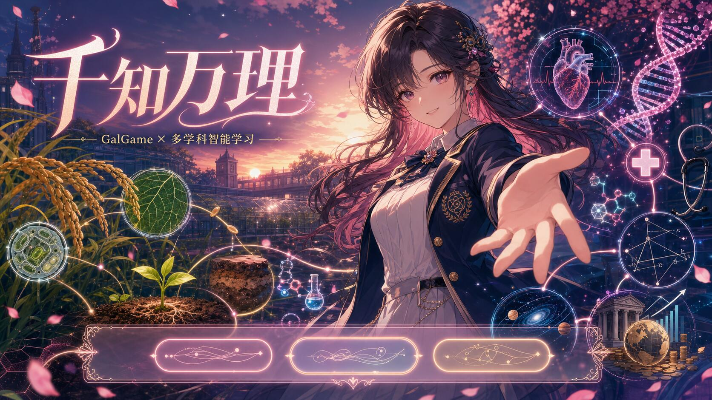

<p align="center">
  
</p>

<h1 align="center">千知万理 · GalReview</h1>

<p align="center">
  <strong>知识有图谱，复习有剧情。</strong><br />
  把熟悉的讲义与笔记，变成一场属于你的校园故事。
</p>

## 关于项目

千知万理（GalReview）是一款将知识整理与 GalGame 互动体验结合起来的复习应用。

上传讲义、笔记或题库后，千知万理会梳理其中的章节与知识点，并把选定的复习内容编入校园剧情。你不必面对枯燥的知识清单：一次对话、一道问题、一个选择，都可能成为继续故事的线索。

这里的复习不只是“做完一道题”，而是和熟悉的角色一起调查、推理、回顾，在故事推进的过程中发现薄弱点，也记住自己已经走过的学习轨迹。

## 你会经历什么

```text
带上自己的资料 → 梳理知识脉络 → 选择本次目标 → 进入互动剧情 → 留下复习记录
```

- **让资料真正成为主角**：从自己的课程内容出发，每一次复习都与眼前的学习目标有关。
- **让知识彼此连接**：从章节到概念，逐步看清知识之间的来龙去脉。
- **让复习拥有故事感**：通过对白、选择与挑战推进剧情，让“再看一遍”变成“继续下一幕”。
- **让进步有迹可循**：保留每次作答与复习进度，方便回顾掌握情况并规划下一次学习。

## 主要角色

三位性格迥异的校园伙伴会陪你走进知识背后的故事。有人善于看穿迷雾，有人总能追到第一手线索，也有人相信一切异常都可以被测量和验证。

<table>
  <tr>
    <td align="center" width="33%">
      
    </td>
    <td align="center" width="33%">
      
    </td>
    <td align="center" width="33%">
      
    </td>
  </tr>
  <tr>
    <td align="center"><strong>林学姐 · 林晚棠</strong></td>
    <td align="center"><strong>苏学妹 · 苏晚晴</strong></td>
    <td align="center"><strong>陆学长 · 陆沉</strong></td>
  </tr>
  <tr>
    <td valign="top">
      神秘学研究社社长。沉静、温柔，似乎总比别人更早察觉藏在日常里的异样。她递来的糖果是鼓励，也可能是一场新调查的邀请。面对混乱的知识，她擅长抓住关键线索，陪你把谜团一点点解开。
    </td>
    <td valign="top">
      新闻社副社长。好奇心旺盛，行动力十足，相机和记事本从不离身。她会把每个新知识都当作值得追踪的独家线索，用接连不断的问题带你重新观察那些容易忽略的细节。
    </td>
    <td valign="top">
      学生会副会长、物理社社长。冷静克制，习惯用记录、测量与推理面对未知。无论问题多复杂，他都会先拆开现象、核对证据，再带你找到最可靠的答案。
    </td>
  </tr>
</table>

## 从一份资料，走进一段剧情

你可以上传课程讲义、课堂笔记或复习题，选择想要巩固的章节与知识点，再决定本次故事的氛围和挑战强度。三位角色会以各自的方式参与其中，让问题不再孤立，让知识随着情节自然展开。

答对时，故事会回应你的判断；遇到不熟悉的内容时，也可以沿着知识脉络回看出处。每一轮结束后，复习记录会成为下一次出发的依据——故事可以告一段落，学习仍会接着向前。

## 项目愿景

我们希望复习不再只是重复阅读和机械作答，而是一段愿意主动继续的体验。

千知万理尝试把属于 GalGame 的陪伴感、选择感和故事感带进日常学习：让角色记得你的进度，让剧情回应你的选择，也让每一个掌握的知识点，都像完成了一段值得纪念的旅程。

> 吹灭读书灯，一身都是月。

## 更多信息

- [开发与接口说明](./docs/contract.md)
- [部署指南](./docs/deploy.md)
- [测试报告](./docs/test_report.md)

---

<p align="center">© 2026 千知万理 · GalReview</p>
