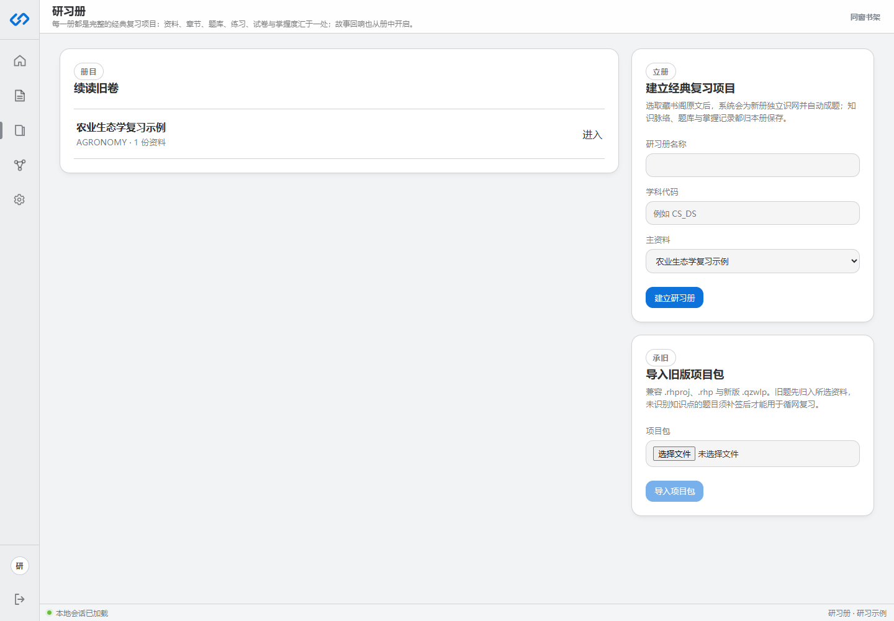

# 快速开始

本页适合第一次使用。完整走完一次流程通常包含注册、上传资料、立册、等待自动成题和开始温习五步。

## 一、注册并进入工作台

打开产品首页，点击“建立第一册研习”，填写显示名称、邮箱和至少 8 个字符的密码。注册成功后会直接进入复习主页。

如果已经有账户，使用[用户登录页面](res/用户登录.png)登录即可。忘记密码时，点击登录页的“忘记密码？”并按邮件验证码重设。

## 二、上传一份适合复习的资料

进入“藏书阁”，选择 PDF、DOCX、Markdown、HTML、TXT 或常见图片。普通文本型 PDF 不要开启 OCR；扫描件和图片才需要开启。

上传完成后，等待右侧状态成为 `READY`。在此之前不要立册，因为系统还没有可核对的规范化文本。

## 三、从藏书阁进入立册

在已经 `READY` 的资料右侧点击“立册”。填写：

- 研习册名称：建议使用课程名、考试名或复习目标。
- 学科代码：用于分类，例如 `AGRONOMY`、`SOCIOLOGY`；不确定可留空。
- 主资料：确认选择的是刚刚解析完成的资料。

点击“建立研习册”后，系统会依次完成本册知识图谱和自动成题。不要重复点击。页面会显示“正在为本册识网”“正在自动成题”等进度。

## 四、确认题库已经可用

进入研习册后，标题下方会显示“可练习题”和“知识点”数量。题目只有同时具备答案、原文依据和本册知识点绑定后，才会成为可练习题。

如果看到“本册还没有可练习题目”，请使用“恢复自动成题”。这通常表示上次生成中断、credits 不足或资料无法形成可靠问题，不表示研习册丢失。

## 五、开始第一次温习

在“本次温习范围”中选择章节，然后选择一种方式：

| 入口 | 适合场景 |
|---|---|
| 开始温习 | 按所选章节练习 |
| 温习薄弱处 | 由 SM-2 到期状态和图谱先修关系安排 |
| 生成并开卷 | 进行有题量和时长约束的模拟试卷 |
| 进入故事回响 | 把同一批知识点放入视觉小说情境 |

作答结束后，系统自动更新掌握度和下一次复习时间，不要求你手动判断自己答得怎样。

## 完成标志

当下面四项都成立时，说明主流程已经可用：

1. 资料状态为 `READY`。
2. 研习册显示知识点数量大于 0。
3. 题库中至少有一道“已入库”题目。
4. 可以进入答题页并提交答案。
