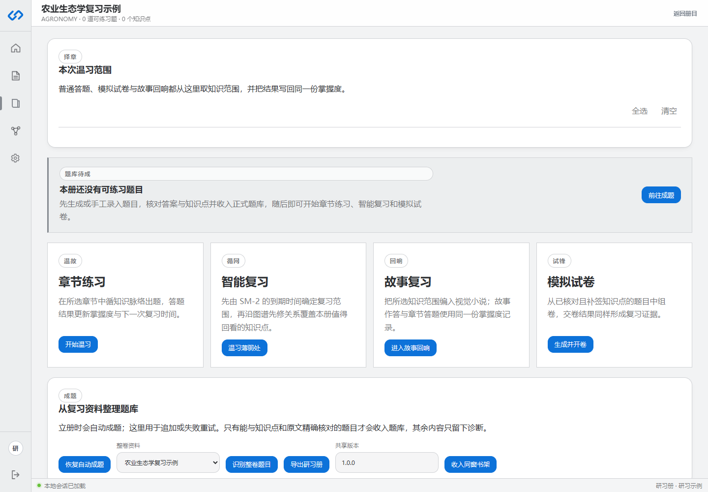

# 研习册与自动成题

研习册是千知万理的核心聚合。它不是 GalGame 项目，而是经典复习项目；故事生成只是其中一种复习能力。

## 立册时会发生什么

从藏书阁选定资料并点击“建立研习册”后，系统按顺序执行：

1. 创建研习册外壳。
2. 在该研习册作用域内切分章节。
3. 抽取知识点和关系，形成识网。
4. 依据全部章节创建学习计划快照。
5. 自动生成单选、填空、名词解释和简答题。
6. 只有来源、答案和知识点均可核对的题目才进入正式题库。

如果第 3 至第 5 步中断，研习册仍然存在，可进入详情页恢复，不需要重新建册。

## 研习册详情页

页面从上到下依次是：

- 择章：选择本次使用的章节。
- 题库待成：仅在没有可练习题时出现。
- 温故、循网、回响、试锋：四种复习入口。
- 成题：追加生成、整卷识题、导出和发布项目包。
- 题笺：本册题库及题目状态。
- 题录：手工加入少量题目。

## 为什么题目可能没有入库

常见原因包括：

- 无法从资料中定位答案原文。
- 题目没有唯一、明确的主知识点。
- 题干或答案不完整。
- 生成任务被取消、超时或 credits 不足。
- 资料文本质量太差。

这些题目应保留诊断或处于草稿状态，不能为了增加数量而强行进入智能复习。

## 题型与填空等价

系统支持单选、填空、判断、名词解释和简答题。填空题使用确定性等价规则处理常见写法，例如：

- `两个`、`二`、`2`
- `(1,3)`、`( 1, 3 )`
- `G+`、`革兰氏阳性`

规则不会使用模糊相似度放过反义词、元组换序或括号边界变化。

## 恢复自动成题

看到“题库待成”时点击“恢复自动成题”。如果提示 credits 不足，先按[Credits 与兑换](Credits与兑换.md)补充余额。如果反复失败，回到藏书阁检查提取文本，并在故障信息中保留 traceId 交给维护者。

## 项目包

- 导出研习册：生成 `.qzwlp` 文件。
- 识别整卷题目：从结构化题库资料导入题目。
- 收入同窗书架：发布不可变版本供其他用户下载。
- 导入旧版项目包：兼容 `.rhproj`、`.rhp` 和 `.qzwlp`。

导入他人项目包后，题目仍须映射到你自己的资料；系统不会把他人的资料所有权复制给你。
