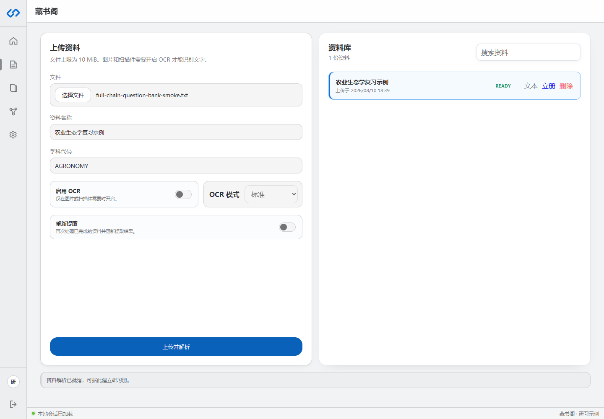
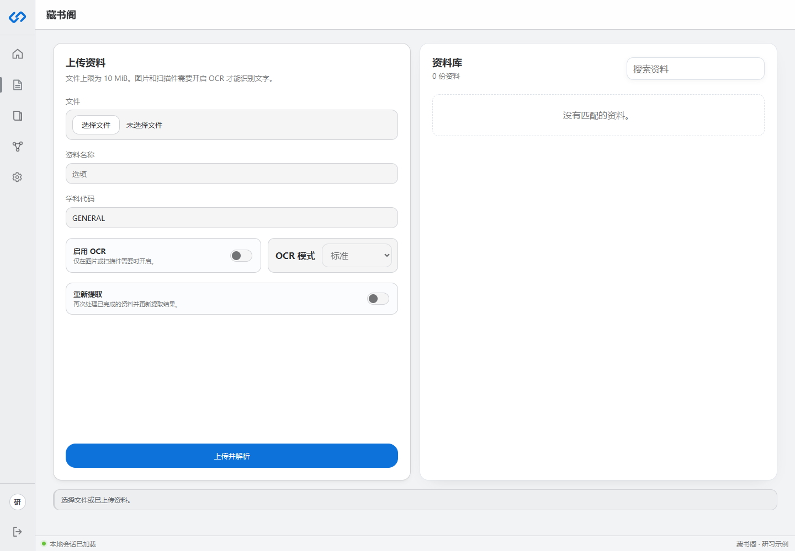

# 藏书阁与资料解析

藏书阁保存原始资料和解析结果。研习册可以引用资料，但知识图谱属于研习册，不属于藏书阁资料。

## 支持的资料

当前界面接受 `.pdf`、`.docx`、`.md`、`.markdown`、`.html`、`.htm`、`.txt`、`.png`、`.jpg` 和 `.jpeg`。单文件上限为 10 MiB。

现阶段更适合农学、社科、历史、语言、生物学等以定义、关系、过程和论述为主的资料。普通长文不必预先整理成题库；系统会先切分章节和证据，再生成题目。

## 上传字段怎么填

- 文件：必须选择。
- 资料名称：选填；留空时使用文件名。
- 学科代码：大写字母、数字和下划线，最长 32 字符，例如 `AGRONOMY`。
- 启用 OCR：只用于图片或扫描件。
- OCR 模式：标准模式更稳，快速模式适合清晰、版式简单的图片。
- 重新提取：对已经处理过的资料重新生成解析结果。

## 状态含义

| 状态 | 含义 | 下一步 |
|---|---|---|
| `UPLOADED` | 文件已保存，尚未完成解析 | 点击资料或重新发起解析 |
| `PROCESSING` | 正在提取文本 | 等待，不要重复上传 |
| `READY` | 解析文本可用 | 查看“文本”或点击“立册” |
| `FAILED` | 解析失败 | 查看错误，调整 OCR 或文件后重试 |
| `DELETED` | 已逻辑删除 | 不再用于新研习册 |

## 如何核对解析文本

点击资料右侧“文本”，系统会显示文本长度、解析器版本和提取内容。重点检查：

1. 章节标题是否保留。
2. 定义、序号和否定词是否完整。
3. 表格是否被打乱。
4. 扫描件是否有明显 OCR 错字。

解析质量会直接影响知识点和题目质量。原文已经明显错乱时，应先调整文件或 OCR 模式，不要急着立册。

## 删除资料的边界

删除前先确认没有仍需使用它的新建流程。已经形成的题目仍保留自己的来源引用，但部署方不应依赖删除后的原文件长期提供预览。
