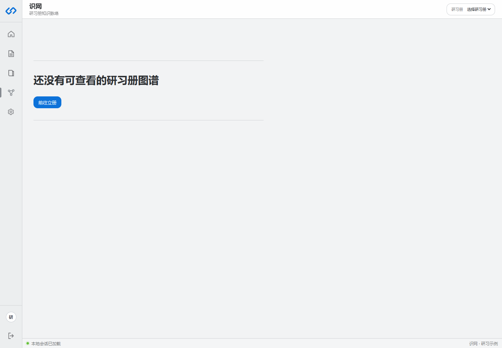
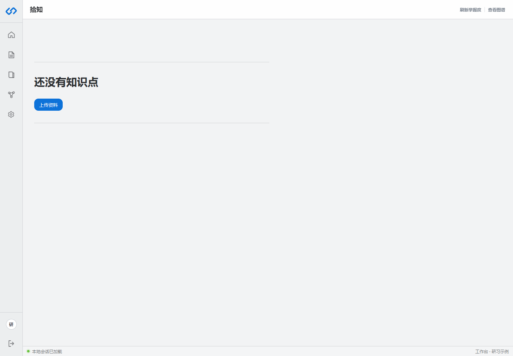

# 识网与知识点

识网是研习册内部的知识图谱。每本研习册有自己的图谱版本、章节、知识点、关系和掌握记录。

## 页面怎么用

1. 在右上方选择研习册。
2. 如果存在多个图谱版本，再选择需要查看的版本。
3. 点击节点查看知识点标题、章节、来源和掌握度。
4. 使用搜索或筛选缩小范围。
5. 通过关系线理解先修、组成或相关关系。

## 为什么图谱属于研习册

同一份资料可能用于不同考试或不同复习目标。各研习册的知识切分、题库范围和掌握状态可能不同，因此图谱必须与研习册绑定，而不能直接挂在藏书阁资料上。

## 拾知页面

“拾知”用于按列表浏览知识点。它适合查看标题、章节、来源状态和掌握情况；“识网”适合查看关系结构。两者读取的是同一本册图谱数据。

## 掌握度从哪里来

掌握度只由有效复习证据更新：

- 普通答题结果。
- 模拟试卷交卷结果。
- 故事回响中的知识绑定题目结果。

低置信自动拒判不会更新掌握度。查看图谱本身也不会产生掌握证据。

## 图谱为空怎么办

- 确认选中的研习册已经完成立册构图。
- 进入研习册详情确认知识点数量。
- 若研习册只有外壳，使用恢复自动成题重新执行构图和题目生成。
- 如果资料没有清晰章节，先核对藏书阁提取文本。
