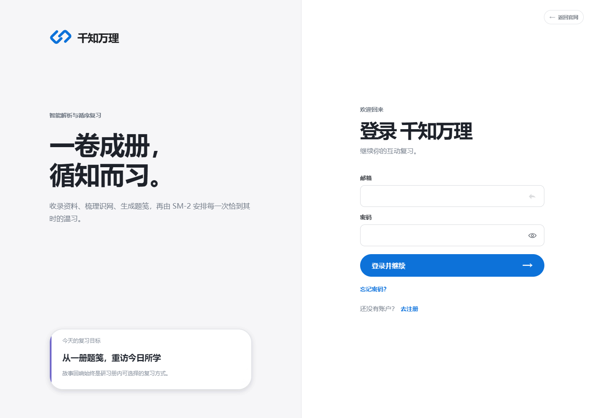
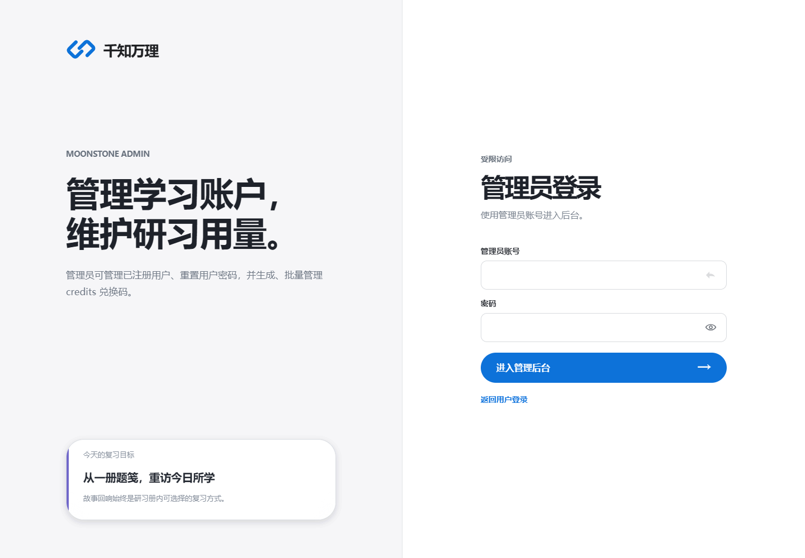

# 账户与登录

## 注册账户

注册只需要显示名称、邮箱和密码，不需要邀请码。每个新用户初始获得 1 credit，用于第一次资料整理和复习项目生成。

密码至少 8 个字符。建议同时包含大小写字母、数字和符号，并且不要与其他网站共用。

## 登录

登录成功后，浏览器会保存当前会话。页面刷新时系统会先向服务端确认会话仍然有效；过期、撤销或不存在的会话会被清理并返回登录页。

如果持续回到登录页：

1. 确认邮箱和密码正确。
2. 检查系统时间是否明显错误。
3. 清除该站点的本地存储后重新登录。
4. 若管理员重置过密码，必须使用新密码重新登录。

## 找回密码

点击“忘记密码？”，输入注册邮箱并发送验证码。验证码只在规定时间内有效。填写验证码和新密码后完成重设。

如果收不到验证码，请先检查垃圾邮件，再由部署管理员确认邮件服务配置。不要让管理员索要旧密码；管理员后台只能设置新密码。

## 退出登录

工作台左侧下方有“退出”按钮。退出会撤销当前会话并清理浏览器中的本地会话数据，不会删除资料、研习册或复习记录。

## 管理员入口

管理员使用独立入口 `/admin/login`，普通用户账户不能直接登录管理后台。

