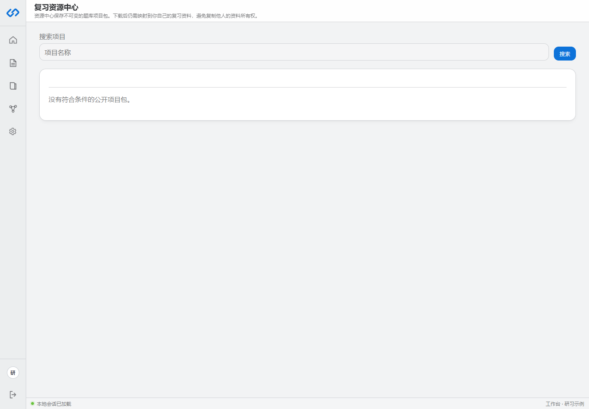

# 项目包与同窗书架

## 支持的格式

| 格式 | 用途 |
|---|---|
| `.qzwlp` | 千知万理当前研习册项目包 |
| `.rhproj` | ReciteHelper 旧项目格式 |
| `.rhp` | ReciteHelper 旧包格式 |

## 导出

在研习册“成题”区域点击“导出研习册”。导出文件包含可迁移的项目和题库数据，不应把服务器上的原资料文件或其他用户所有权打包进去。

## 导入

在研习册列表右侧“承旧”区域选择项目包，同时指定自己藏书阁中已经 `READY` 的资料。导入器会把旧题映射到所选资料。

未能识别知识点或来源的题目会保持草稿，不进入智能复习。对大量旧题逐题人工补签会严重破坏体验，因此系统会优先使用题干、答案和来源区间自动绑定；只有无法可靠确定时才保留诊断。

## 发布到同窗书架

输入版本号并选择发布后，系统创建不可变的共享包。公开包可在“复习资源中心”被搜索和下载。

发布前检查：

1. 不包含隐私、内部资料或无权分发的题目。
2. 版本号准确。
3. 题目答案和知识点已经核对。
4. 包内不依赖上传者账户的临时链接。

## 下载后为什么仍要选择资料

共享包复用的是题库结构，不转移原资料所有权。下载者必须用自己的资料完成来源映射，才能获得可追溯的答案依据。
